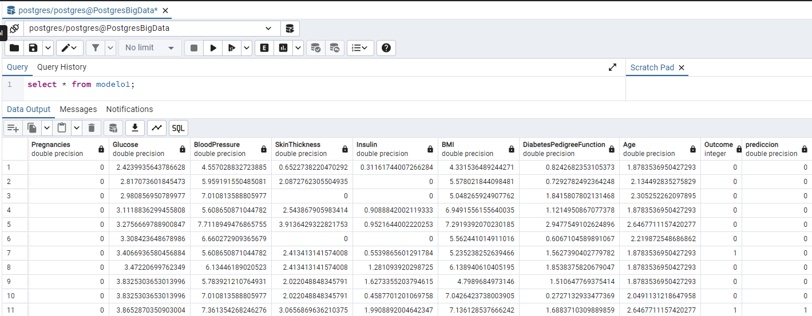

## Big Data en el Programa para Ciencia de los Datos, FUNDATEC
### Tarea 3: Alejandro Quesada, Joshua Solís
El repositorio actual comprende los archivos generados para la tarea 3, que son necesarios para su correcto funcionamiento.

## Manual de Ejecución
Debe ejecutarse en este orden:
1. `bash build_image.sh` para crear la imagen con Docker.
2. `bash run-postgres.sh` para levantar la imagen de la Base de Datos.
    * Credenciales: usuario= `postgres`, contraseña=`pword`, puerto=`5433`
2. `bash run_image.sh`. Esto levanta un contenedor usando la imagen del paso anterior, con el nombre `bd-tarea3`, y el contenedor se llamará `bd-tarea3-container`. De nuevo si no le es disponible bash en esta etapa, puede ejecutar este comando: `docker run -p 8888:8888 -it --rm --name bd-tarea3-container bd-tarea3 /bin/bash`
3. Procure asegurarse de estar desde el shell de Bash dentro de la imagen. Debería mostrarle `bash-5.0#` en la línea de comandos.
4. `bash jupyter-server.sh`. Este paso es clave pues se encarga de ejecutar el servidor de Jupyter.
5. Copiar el enlace al final de la salida generada por el paso anterior, o dar ctrl+clic sobre el enlace. Por lo que esto es necesario es por el _token_ que es autogenerado, y si usted únicamente se intenta conectar al puerto 8888 en `localhost`, le pedirá este token o clave de autenticación.

### Ejecución del cuaderno de Jupyter: cosas qué considerar
El cuaderno ya tiene las salidas de la última ejecución, la cual fue probada varias veces previo a realizar la entrega del trabajo. Si de igual forma se desea ejecutar, tenga los siguientes datos en cuenta:
* El entrenamiento del Random Forest arroja unos warnings que se deben a la configuración de spark, cada vez que se dispara un hilo que utiliza una cantidad "alta" de memoria. Esto decidimos no cambiarlo para evitar causar un error mayor si nos deshacíamos de los registros (logs) a la altura de `WARN` y solo nos quedábamos con los `ERROR`. **Al final** de esta celda en la que se ejecutan, podrá ver que se imprimen los valores "óptimos" del random forest con los cuales se trabajará de ahí en adelante.
* Tanto el entrenamiento de RF antes mencionado, como el uso de Cross-Validation, son **extremadamente lentos** si se ejecutan en arquitecturas distintas a la de la plataforma del contenedor (amd64), esto lo probamos usando una computadora con un procesador Apple M2, el cual, al tener que emular las instrucciones, toma mucho más tiempo en completar la ejecución del cuaderno.
* Lo anterior se probó en máquinas "host" del contenedor tanto en Windows 11 como en Ubuntu Linux, eso sí, con procesadores de la misma arquitectura, y el entrenamiento mencionado, pese a tampoco ser instantáneo, no se vuelve algo que tome más de 5 minutos en nuestras máquinas.

Es importante mencionar, eso sí, que según el dashboard de Docker, los contenedores llegan a usar hasta 5 CPUs en nuestras máquinas, por lo que una con menor cantidad de procesadores lógicos disponibles probablemente se tarde más tiempo.

* El guardado de los datos en postgres también se validó por medio del cliente pgAdmin, conectándose con las credenciales especificadas más arriba en este manual. Existen capturas de pantalla evidenciando esto en las últimas celdas del cuaderno, pero en caso de que se pierdan durante su ejecución, también se presentan a continuación.

